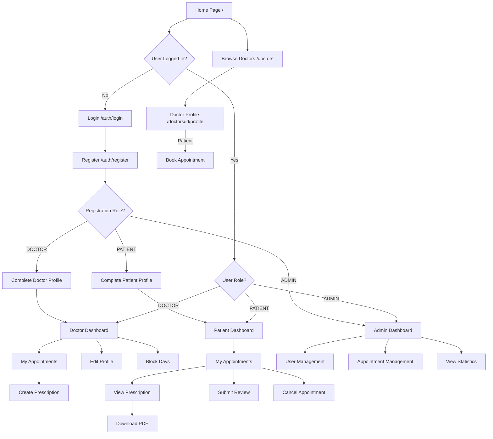
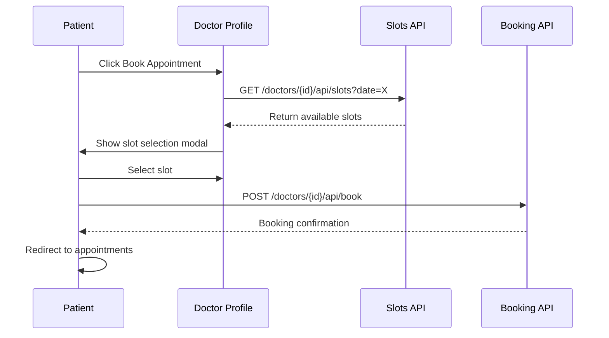
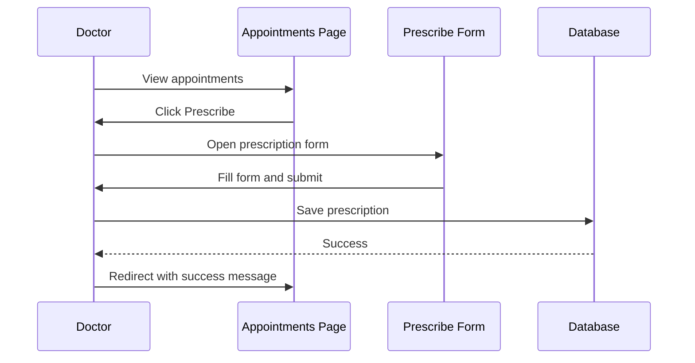
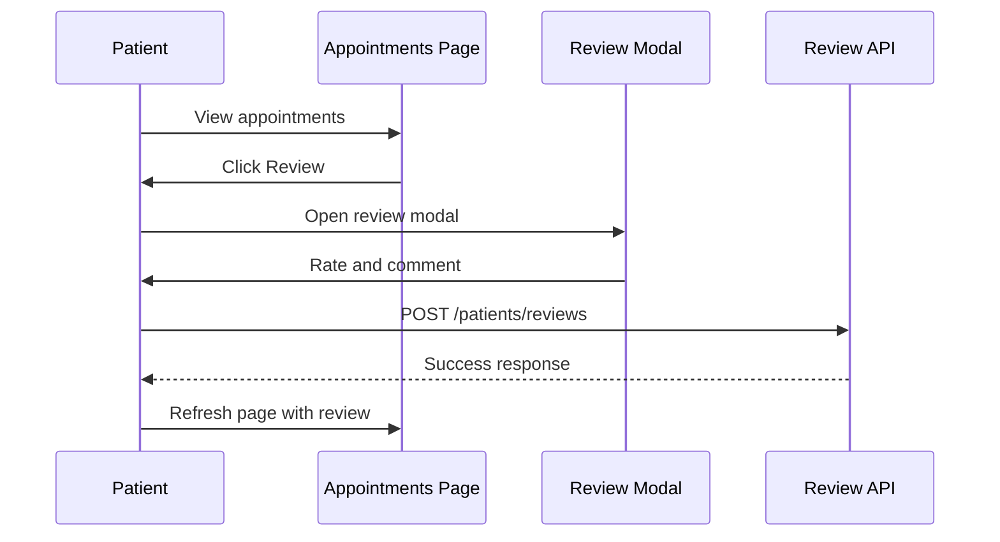

# Web Pages & Navigation Documentation

## Navigation Flow Diagram



## Page Catalog

### Public Pages

#### 1. Home Page (`/`)
**Purpose**: Landing page for the application  
**Access**: Public  
**Features**:
- Welcome message
- Quick links to browse doctors
- Login/Register buttons
- About the system

**Navigation**:
- → Login: `/auth/login`
- → Register: `/auth/register`
- → Browse Doctors: `/doctors`
- → Available Doctors: `/available`

---

#### 2. Login Page (`/auth/login`)
**Purpose**: User authentication  
**Access**: Public (redirects if already authenticated)  
**Features**:
- Email and password input
- Role-based redirect after login
- "Remember Me" functionality via cookies
- Link to registration

**Form Fields**:
- Email (required, validated)
- Password (required)

**Navigation**:
- → Register: `/auth/register`
- Success → Based on role:
  - Admin: `/admin/dashboard`
  - Doctor (complete): `/doctors/profile`
  - Doctor (incomplete): `/doctors/complete-registration`
  - Patient (complete): `/patients/profile`
  - Patient (incomplete): `/patients/complete-registration`

---

#### 3. Registration Page (`/auth/register`)
**Purpose**: New user account creation  
**Access**: Public  
**Features**:
- Email, password, and role selection
- Validation (email format, password strength)
- Automatic JWT token generation

**Form Fields**:
- Email (required, unique)
- Password (required, min 6 chars)
- Role (DOCTOR, PATIENT, ADMIN)

**Navigation**:
- → Login: `/auth/login`
- Success → Profile completion page

---

#### 4. Doctor List (`/doctors`)
**Purpose**: Browse all doctors  
**Access**: Public  
**Features**:
- Pagination (12 per page)
- Filter by speciality
- Search by doctor name
- Doctor cards with ratings

**Filters**:
- Speciality dropdown
- Name search box

**Navigation**:
- → Doctor Profile: `/doctors/{id}/profile`

---

#### 5. Doctor Profile Page (`/doctors/{id}/profile`)
**Purpose**: View doctor details and book appointments  
**Access**: Public (booking requires authentication)  
**Features**:
- Doctor information (name, degree, speciality, address)
- Consultation fee and hours
- Monthly availability calendar
- Reviews and ratings
- Booking interface (for logged-in patients)

**Calendar**:
- Color-coded days (available, partial, full, past, off)
- Click to view slots
- Real-time availability

**Navigation**:
- → Book Appointment: Modal with time slots
- → Reviews: `/doctors/{id}/reviews`
- → Previous/Next Month: Query params `?year=X&month=Y`

---

#### 6. Available Doctors (`/available`)
**Purpose**: Show doctors with upcoming availability  
**Access**: Public  
**Features**:
- List of doctors with next available date
- Pagination
- Quick booking access

---

### Doctor Pages

#### 7. Complete Doctor Registration (`/doctors/complete-registration`)
**Purpose**: First-time doctor profile setup  
**Access**: Authenticated (DOCTOR role, incomplete profile)  
**Features**:
- Comprehensive profile form
- Validation for all fields
- Sets user.complete = true on submission

**Form Fields**:
- Doctor Name
- Degree
- Speciality
- Consultation Hours (start/end)
- Consultation Fee
- Clinic Address
- Contact Number
- Off Days (multi-select)

**Navigation**:
- Success → `/doctors/profile`

---

#### 8. Doctor Dashboard (`/doctors/profile`)
**Purpose**: Doctor's main dashboard  
**Access**: Authenticated (DOCTOR role)  
**Features**:
- Redirects to own profile page
- Shows appointments
- Profile management links

**Navigation**:
- → My Appointments: `/doctors/my-appointments`
- → Edit Profile: `/doctors/{id}/edit`
- → Block Days: `/doctors/{id}/block-days`
- → View Public Profile: `/doctors/{id}/profile`

---

#### 9. Edit Doctor Profile (`/doctors/{id}/edit`)
**Purpose**: Update doctor information  
**Access**: Authenticated (DOCTOR - own profile, or ADMIN)  
**Features**:
- Pre-filled form with current data
- Same validation as registration
- Cache invalidation on update

**Navigation**:
- Cancel → `/doctors/{id}/profile`
- Success → `/doctors/{id}/profile?success`

---

#### 10. Doctor Appointments (`/doctors/my-appointments`)
**Purpose**: View and manage appointments  
**Access**: Authenticated (DOCTOR role)  
**Features**:
- List of all appointments (past and upcoming)
- Status indicators (CONFIRMED, CANCELLED)
- Action buttons (Prescribe, Cancel, View)
- Patient information
- Prescription status

**Actions**:
- Create Prescription
- View Prescription
- Cancel Appointment

**Navigation**:
- → Prescribe: `/doctors/appointments/{id}/prescribe`
- → View Prescription: `/doctors/appointments/{id}/view-prescription`

---

#### 11. Create Prescription (`/doctors/appointments/{id}/prescribe`)
**Purpose**: Create or edit prescription  
**Access**: Authenticated (DOCTOR role, owns appointment)  
**Features**:
- Comprehensive prescription form
- Auto-save timestamp
- Read-only patient and appointment info

**Form Fields**:
- Chief Complaint
- History
- Examination Findings
- Diagnosis
- Medicines
- Advice
- Next Visit

**Navigation**:
- Cancel → `/doctors/my-appointments`
- Success → `/doctors/my-appointments?prescription_saved`

---

#### 12. Block Days Management (`/doctors/{id}/block-days`)
**Purpose**: Manage unavailable dates  
**Access**: Authenticated (DOCTOR role, own profile)  
**Features**:
- List of upcoming blocked dates
- Date picker to block new dates
- Unblock button for each blocked date
- Warning about appointment cancellation

**Navigation**:
- Block Day → Redirects to `/doctors/{id}/profile`
- Unblock Day → Stays on page with success message

---

### Patient Pages

#### 13. Complete Patient Registration (`/patients/complete-registration`)
**Purpose**: First-time patient profile setup  
**Access**: Authenticated (PATIENT role, incomplete profile)  
**Features**:
- Simple profile form
- Contact validation

**Form Fields**:
- Patient Name
- Email
- Gender (dropdown)
- Contact Number

**Navigation**:
- Success → `/patients/profile`

---

#### 14. Patient Dashboard (`/patients/profile`)
**Purpose**: Patient's main dashboard  
**Access**: Authenticated (PATIENT role)  
**Features**:
- Patient information card
- Available doctors list
- Filter by speciality
- Pagination
- Quick booking

**Sections**:
1. Profile Summary
2. Available Doctors (with next available date)
3. Speciality Filter

**Navigation**:
- → My Appointments: `/patients/appointments`
- → Doctor Profile: `/doctors/{id}/profile` (for booking)

---

#### 15. Patient Appointments (`/patients/appointments`)
**Purpose**: View appointment history  
**Access**: Authenticated (PATIENT role)  
**Features**:
- Chronological appointment list
- Status indicators
- Prescription access
- Review submission
- Cancel option

**For Each Appointment**:
- Doctor information
- Date and time
- Status
- Actions (View Prescription, Cancel, Review)

**Navigation**:
- → View Prescription: `/patients/prescriptions/{id}`
- → Download PDF: `/patients/prescriptions/{id}/download-pdf`

---

#### 16. View Prescription (`/patients/prescriptions/{appointmentId}`)
**Purpose**: View prescription details  
**Access**: Authenticated (PATIENT role, owns appointment)  
**Features**:
- Full prescription display
- Doctor and patient information
- Download PDF button
- Printer-friendly format

**Navigation**:
- → Download PDF: `/patients/prescriptions/{id}/download-pdf`
- → Back to Appointments: `/patients/appointments`

---

### Admin Pages

#### 17. Admin Dashboard (`/admin/dashboard`)
**Purpose**: System administration and monitoring  
**Access**: Authenticated (ADMIN role)  
**Features**:
- Statistics cards (users, appointments, etc.)
- User management table with pagination
- Appointment management table
- Recent registrations
- System alerts
- Search and filter capabilities

**Statistics**:
- Total Users (by role)
- Total Appointments (by status)
- Incomplete Profiles
- Recent Activity

**User Management**:
- View all users
- Filter by role
- Search by email
- Delete users (with cascade)
- Pagination

**Appointment Management**:
- View all appointments
- Filter by status
- Filter by date range
- Search by patient/doctor
- Cancel appointments
- View details

**Navigation**:
- → View Appointment: `/admin/appointments/{id}/view`
- Delete User: Inline action
- Cancel Appointment: Inline action

---

#### 18. View Appointment (Admin) (`/admin/appointments/{id}/view`)
**Purpose**: Detailed appointment view for admin  
**Access**: Authenticated (ADMIN role)  
**Features**:
- Complete appointment information
- Doctor and patient details
- Prescription (if exists)
- Status and history

**Navigation**:
- → Back to Dashboard: `/admin/dashboard`

---

## Common Page Elements

### Navigation Bar
**Appears on**: All authenticated pages

**For Guest Users**:
- Home
- Browse Doctors
- Available Doctors
- Login
- Register

**For Doctors**:
- Home
- My Profile
- My Appointments
- Browse Doctors
- Logout

**For Patients**:
- Home
- My Profile
- My Appointments
- Browse Doctors
- Logout

**For Admins**:
- Dashboard
- Browse Doctors
- Logout

---

### Footer
**Appears on**: All pages

**Contains**:
- Copyright information
- About link
- Contact link
- Terms of Service
- Privacy Policy

---

## Page Interactions

### Booking Flow


### Prescription Flow


### Review Flow


---

## Responsive Design

### Mobile View (<768px)
- Collapsed navigation menu
- Stacked cards
- Single column layouts
- Touch-optimized buttons
- Simplified tables (key info only)

### Tablet View (768px - 1024px)
- Two-column layouts
- Expandable navigation
- Condensed tables

### Desktop View (>1024px)
- Full navigation bar
- Multi-column layouts
- Complete data tables
- Enhanced calendars

---

## Page Templates (Thymeleaf)

### Template Structure
```
src/main/resources/templates/
├── auth/
│   ├── login.html
│   └── register.html
├── doctors/
│   ├── profile.html
│   ├── list.html
│   ├── edit.html
│   ├── my-appointments.html
│   ├── prescribe.html
│   ├── view-prescription.html
│   └── block-days.html
├── patients/
│   ├── profile.html
│   ├── appointments.html
│   ├── view-prescription.html
│   └── view-prescription-pdf.html
├── admin/
│   ├── dashboard.html
│   └── view-appointment.html
├── fragments/
│   ├── header.html
│   ├── footer.html
│   └── navbar.html
├── home.html
├── available.html
└── reviews.html
```

### Common Fragments
- **header.html**: HTML head, meta tags, CSS links
- **navbar.html**: Navigation bar (role-based)
- **footer.html**: Footer content

---

## Access Control Summary

| Page | Public | Patient | Doctor | Admin |
|------|--------|---------|--------|-------|
| Home | ✓ | ✓ | ✓ | ✓ |
| Login | ✓ | ✓* | ✓* | ✓* |
| Register | ✓ | ✓* | ✓* | ✓* |
| Browse Doctors | ✓ | ✓ | ✓ | ✓ |
| Doctor Profile | ✓ | ✓ | ✓ | ✓ |
| Available Doctors | ✓ | ✓ | ✓ | ✓ |
| Patient Dashboard | ✗ | ✓ | ✗ | ✗ |
| Patient Appointments | ✗ | ✓ | ✗ | ✗ |
| Doctor Dashboard | ✗ | ✗ | ✓ | ✗ |
| Doctor Appointments | ✗ | ✗ | ✓ | ✗ |
| Create Prescription | ✗ | ✗ | ✓ | ✗ |
| Admin Dashboard | ✗ | ✗ | ✗ | ✓ |

\* Redirects to dashboard if already authenticated

---

**Frontend Framework**: Thymeleaf (Server-Side Rendering)  
**CSS Framework**: Bootstrap 5 / Tailwind CSS  
**JavaScript**: Vanilla JS with Fetch API  
**Icons**: Font Awesome / Bootstrap Icons