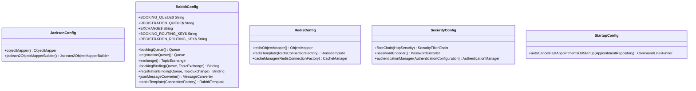

# UML Class Diagrams

## Domain Model - Core Entities

## Service Layer Architecture

```mermaid
classDiagram
    class UserService {
        <<interface>>
        +registerUser(User) User
        +authenticate(String, String) User
        +findByEmail(String) Optional~User~
        +markProfileComplete(Long) void
    }

    class UserServiceImpl {
        -UserRepository userRepository
        -PasswordEncoder passwordEncoder
        +registerUser(User) User
        +authenticate(String, String) User
        +markProfileComplete(Long) void
    }

    class DoctorService {
        <<interface>>
        +findAll() List~Doctor~
        +createDoctorProfile(Long, DoctorDto) Doctor
        +updateDoctorProfile(Long, DoctorDto) Doctor
        +getDoctorById(Long) Doctor
        +blockDay(Long, LocalDate) void
    }

    class DoctorServiceImpl {
        -DoctorRepository doctorRepository
        -UserRepository userRepository
        -ReviewRepository reviewRepository
        +createDoctorProfile(Long, DoctorDto) Doctor
        +updateDoctorProfile(Long, DoctorDto) Doctor
        +getAverageRatingForDoctor(Long) Double
    }

    class PatientService {
        <<interface>>
        +createPatientProfile(Long, PatientDto, User) Patient
        +updatePatientProfile(Long, PatientDto) Patient
        +bookAppointment(Long, Long, LocalDate, String) Appointment
        +submitReview(Long, Long, Integer, String) Review
    }

    class PatientServiceImpl {
        -PatientRepository patientRepository
        -AppointmentRepository appointmentRepository
        -ReviewRepository reviewRepository
        -RabbitProducerService rabbitProducerService
        +bookAppointment(Long, Long, LocalDate, String) Appointment
        +submitReview(Long, Long, Integer, String) Review
    }

    class AppointmentService {
        <<interface>>
        +getById(Long) Appointment
        +bookAppointment(Appointment) Appointment
        +cancelAppointment(Appointment) void
    }

    class AppointmentServiceImpl {
        -AppointmentRepository appointmentRepository
        +bookAppointment(Appointment) Appointment
        +cancelConfirmedAppointmentsForDoctorOnDate(Long, LocalDate) int
    }

    class AdminService {
        <<interface>>
        +deleteUser(Long) String
        +getDashboardStats() DashboardStats
        +getUsers(int, int, String, String) Page~User~
        +cancelAppointment(Long) void
    }

    class AdminServiceImpl {
        -DoctorRepository doctorRepository
        -PatientRepository patientRepository
        -AppointmentRepository appointmentRepository
        -UserRepository userRepository
        +deleteUser(Long) String
        +getDashboardStats() DashboardStats
    }

    UserService <|.. UserServiceImpl : implements
    DoctorService <|.. DoctorServiceImpl : implements
    PatientService <|.. PatientServiceImpl : implements
    AppointmentService <|.. AppointmentServiceImpl : implements
    AdminService <|.. AdminServiceImpl : implements
```

## Repository Layer

## Controller Layer

## Security Layer

## Messaging Layer

## DTO Layer

```mermaid
classDiagram
    class DoctorDto {
        -String doctorName
        -String email
        -String degree
        -String speciality
        -String consultationStartTime
        -String consultationEndTime
        -String offDays
        -Integer consultationFee
        -String address
        -String contact
    }

    class PatientDto {
        -String patientName
        -String patientEmail
        -String gender
        -String contact
    }

    class AuthRequest {
        -String email
        -String password
        -String role
    }

    class AuthResponse {
        -String token
        -String tokenType
    }

    class TimeSlot {
        -int id
        -String slotName
        -String startTime
        -String endTime
        -String session
    }

    class DayStatus {
        -LocalDate date
        -String status
        -int bookedCount
        -int availableCount
        -boolean isToday
        -String dayName
    }

    class ReviewDto {
        -Integer rating
        -String comment
        -LocalDateTime createdAt
        -String patientName
    }

    class DoctorWithRatingDto {
        -Doctor doctor
        -Double averageRating
        -Long reviewCount
    }

    class AvailableDoctorSummary {
        -Doctor doctor
        -LocalDate nextAvailableDate
        -int availableSlotsNextWeek
    }

    class BookAppointmentRequest {
        -int slotId
        -LocalDate appointmentDate
    }

    class BookAppointmentResponse {
        -boolean success
        -String message
        -Long appointmentId
        -String error
    }

    class DashboardStats {
        -long totalAdmins
        -long totalDoctors
        -long totalPatients
        -long totalUsers
        -long totalAppointments
        -long confirmedAppointments
        -long cancelledAppointments
    }

    class DoctorAppointmentDto {
        -Appointment appointment
        -Patient patientProfile
        -Prescription prescription
    }
```

## Configuration Classes

## Key Design Patterns Used

### 1. **Repository Pattern**
- Abstracts data access logic
- Provides clean interface for CRUD operations
- Implemented via Spring Data JPA

### 2. **Service Layer Pattern**
- Encapsulates business logic
- Transactional boundaries
- Clear separation of concerns

### 3. **DTO Pattern**
- Data transfer between layers
- Prevents entity exposure
- Validation at boundaries

### 4. **Transactional Outbox Pattern**
- Reliable messaging
- Atomic database + message queue operations
- Retry mechanism for failures

### 5. **Strategy Pattern**
- Different user role behaviors
- Service implementations for each role
- Role-based access control

### 6. **Factory Pattern**
- TimeSlot generation
- Calendar day status creation

### 7. **Template Method Pattern**
- Spring's Template classes (JdbcTemplate, RabbitTemplate)
- Consistent error handling

---

**Architecture**: Layered Architecture (Presentation → Service → Repository → Database)  
**Framework**: Spring Boot with dependency injection  
**Persistence**: JPA/Hibernate ORM