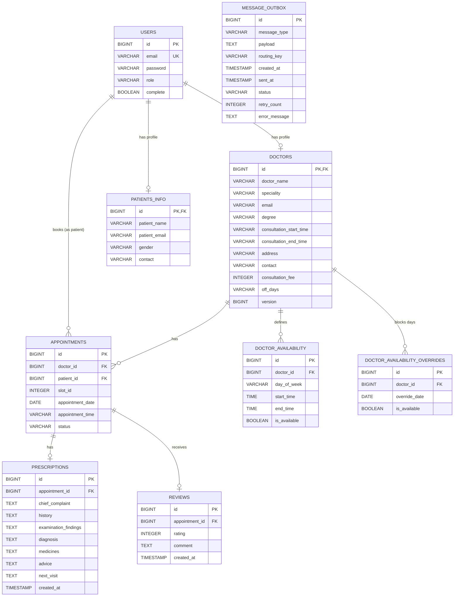

# Database Architecture Documentation

## Supported Databases

### Production Database
- **RDBMS**: PostgreSQL 14+
- **Connection Pool**: HikariCP (default in Spring Boot)
- **ORM**: Hibernate 6.x

### Development/Testing
- **H2 Database**: In-memory database for testing
- **Configuration**: Can be switched via `application.properties`

### Cache Database
- **Redis 6+**: For caching frequently accessed data
- **Serialization**: JSON with Jackson

## Entity Relationship Diagram (ERD)



## Table Specifications

### 1. USERS
**Purpose**: Core authentication and user management table

| Column | Type | Constraints | Description |
|--------|------|-------------|-------------|
| id | BIGINT | PRIMARY KEY, AUTO_INCREMENT | Unique user identifier |
| email | VARCHAR(255) | UNIQUE, NOT NULL | User email (login credential) |
| password | VARCHAR(255) | NOT NULL | BCrypt hashed password |
| role | VARCHAR(50) | NOT NULL | User role: ADMIN, DOCTOR, PATIENT |
| complete | BOOLEAN | DEFAULT false | Profile completion status |

**Indexes**:
- PRIMARY KEY on `id`
- UNIQUE INDEX on `email`

**Business Rules**:
- Email must be unique across all users
- Password stored as BCrypt hash
- Profile marked complete after role-specific registration

---

### 2. DOCTORS
**Purpose**: Doctor professional profiles

| Column | Type | Constraints | Description |
|--------|------|-------------|-------------|
| id | BIGINT | PRIMARY KEY, FOREIGN KEY | Same as user.id (shared PK) |
| doctor_name | VARCHAR(255) | NOT NULL | Full name of doctor |
| speciality | VARCHAR(100) | NOT NULL | Medical specialization |
| email | VARCHAR(255) | | Professional email |
| degree | VARCHAR(255) | NOT NULL | Medical qualifications |
| consultation_start_time | VARCHAR(10) | NOT NULL | Start time (HH:mm format) |
| consultation_end_time | VARCHAR(10) | NOT NULL | End time (HH:mm format) |
| address | VARCHAR(500) | NOT NULL | Clinic address |
| contact | VARCHAR(15) | NOT NULL | Contact number (01XXXXXXXXX) |
| consultation_fee | INTEGER | NOT NULL | Fee in BDT (min: 100) |
| off_days | VARCHAR(100) | | Comma-separated days (e.g., "FRIDAY,SATURDAY") |
| version | BIGINT | | Optimistic locking version |

**Indexes**:
- PRIMARY KEY on `id`
- FOREIGN KEY on `id` references `users(id)`
- INDEX on `speciality` (for filtering)

**Business Rules**:
- One-to-one relationship with Users
- Contact must match pattern: `^01[0-9]{9}$`
- Consultation time slot: 20 minutes each
- Off days are optional

---

### 3. PATIENTS_INFO
**Purpose**: Patient personal information

| Column | Type | Constraints | Description |
|--------|------|-------------|-------------|
| id | BIGINT | PRIMARY KEY, FOREIGN KEY | Same as user.id (shared PK) |
| patient_name | VARCHAR(255) | NOT NULL | Full name of patient |
| patient_email | VARCHAR(255) | NOT NULL | Patient email |
| gender | VARCHAR(10) | NOT NULL | Gender (Male/Female/Other) |
| contact | VARCHAR(15) | NOT NULL | Contact number (01XXXXXXXXX) |

**Indexes**:
- PRIMARY KEY on `id`
- FOREIGN KEY on `id` references `users(id)`

**Business Rules**:
- One-to-one relationship with Users
- Contact must match pattern: `^01[0-9]{9}$`

---

### 4. APPOINTMENTS
**Purpose**: Appointment bookings between doctors and patients

| Column | Type | Constraints | Description |
|--------|------|-------------|-------------|
| id | BIGINT | PRIMARY KEY, AUTO_INCREMENT | Unique appointment ID |
| doctor_id | BIGINT | FOREIGN KEY, NOT NULL | Reference to doctors table |
| patient_id | BIGINT | FOREIGN KEY, NOT NULL | Reference to users table |
| slot_id | INTEGER | | Time slot identifier (1-N) |
| appointment_date | DATE | NOT NULL | Date of appointment |
| appointment_time | VARCHAR(50) | NOT NULL | Time range (e.g., "09:00 AM - 09:20 AM") |
| status | VARCHAR(20) | NOT NULL, DEFAULT 'CONFIRMED' | CONFIRMED or CANCELLED |

**Indexes**:
- PRIMARY KEY on `id`
- FOREIGN KEY on `doctor_id` references `doctors(id)`
- FOREIGN KEY on `patient_id` references `users(id)`
- COMPOSITE INDEX on `(doctor_id, appointment_date)` (for availability queries)
- INDEX on `(doctor_id, appointment_date, status)` (for confirmed slots)

**Business Rules**:
- Cannot book same slot twice for same doctor/date
- Past appointments auto-cancelled on startup if not completed
- Cannot cancel after prescription created

---

### 5. PRESCRIPTIONS
**Purpose**: Medical prescriptions for appointments

| Column | Type | Constraints | Description |
|--------|------|-------------|-------------|
| id | BIGINT | PRIMARY KEY, AUTO_INCREMENT | Unique prescription ID |
| appointment_id | BIGINT | FOREIGN KEY, NOT NULL | Reference to appointments |
| chief_complaint | TEXT | | Patient's main complaint |
| history | TEXT | | Medical history |
| examination_findings | TEXT | | Physical examination results |
| diagnosis | TEXT | | Medical diagnosis |
| medicines | TEXT | | Prescribed medications |
| advice | TEXT | | Medical advice |
| next_visit | TEXT | | Next appointment recommendation |
| created_at | TIMESTAMP | | Prescription creation time |

**Indexes**:
- PRIMARY KEY on `id`
- UNIQUE INDEX on `appointment_id`
- FOREIGN KEY on `appointment_id` references `appointments(id)`

**Business Rules**:
- One-to-one relationship with Appointments
- Only doctor who owns appointment can create prescription
- Cascade delete when appointment deleted

---

### 6. REVIEWS
**Purpose**: Patient ratings and feedback for doctors

| Column | Type | Constraints | Description |
|--------|------|-------------|-------------|
| id | BIGINT | PRIMARY KEY, AUTO_INCREMENT | Unique review ID |
| appointment_id | BIGINT | FOREIGN KEY, NOT NULL | Reference to appointments |
| rating | INTEGER | NOT NULL, CHECK(1-5) | Star rating (1 to 5) |
| comment | TEXT | | Optional review text |
| created_at | TIMESTAMP | NOT NULL | Review creation time |

**Indexes**:
- PRIMARY KEY on `id`
- UNIQUE INDEX on `appointment_id`
- FOREIGN KEY on `appointment_id` references `appointments(id)`
- INDEX on `appointment.doctor_id` (for aggregation queries)

**Business Rules**:
- One review per appointment
- Rating must be between 1 and 5
- Only patient who owns appointment can review
- Can only review CONFIRMED appointments

---

### 7. DOCTOR_AVAILABILITY
**Purpose**: Regular weekly availability schedule

| Column | Type | Constraints | Description |
|--------|------|-------------|-------------|
| id | BIGINT | PRIMARY KEY, AUTO_INCREMENT | Unique availability ID |
| doctor_id | BIGINT | FOREIGN KEY, NOT NULL | Reference to doctors |
| day_of_week | VARCHAR(20) | NOT NULL | Day name (MONDAY-SUNDAY) |
| start_time | TIME | NOT NULL | Availability start time |
| end_time | TIME | NOT NULL | Availability end time |
| is_available | BOOLEAN | DEFAULT true | Availability flag |

**Indexes**:
- PRIMARY KEY on `id`
- FOREIGN KEY on `doctor_id` references `doctors(id)`
- COMPOSITE INDEX on `(doctor_id, day_of_week)`

**Business Rules**:
- Defines recurring weekly schedule
- Can have multiple slots per day
- Overridden by specific date blocks

---

### 8. DOCTOR_AVAILABILITY_OVERRIDES
**Purpose**: Block or unblock specific dates

| Column | Type | Constraints | Description |
|--------|------|-------------|-------------|
| id | BIGINT | PRIMARY KEY, AUTO_INCREMENT | Unique override ID |
| doctor_id | BIGINT | FOREIGN KEY, NOT NULL | Reference to doctors |
| override_date | DATE | NOT NULL | Specific date to override |
| is_available | BOOLEAN | | Availability on this date |

**Indexes**:
- PRIMARY KEY on `id`
- FOREIGN KEY on `doctor_id` references `doctors(id)`
- UNIQUE INDEX on `(doctor_id, override_date)`

**Business Rules**:
- Overrides regular availability for specific dates
- `is_available = false` blocks the entire day
- Deleting record removes override (reverts to regular schedule)
- Cancels existing confirmed appointments when blocking

---

### 9. MESSAGE_OUTBOX
**Purpose**: Transactional outbox pattern for reliable messaging

| Column | Type | Constraints | Description |
|--------|------|-------------|-------------|
| id | BIGINT | PRIMARY KEY, AUTO_INCREMENT | Unique message ID |
| message_type | VARCHAR(50) | NOT NULL | BOOKING or REGISTRATION |
| payload | TEXT | NOT NULL | JSON message payload |
| routing_key | VARCHAR(100) | NOT NULL | RabbitMQ routing key |
| created_at | TIMESTAMP | NOT NULL | Message creation time |
| sent_at | TIMESTAMP | | Successful send time |
| status | VARCHAR(20) | NOT NULL | PENDING, SENT, or FAILED |
| retry_count | INTEGER | DEFAULT 0 | Number of retry attempts |
| error_message | TEXT | | Last error details |

**Indexes**:
- PRIMARY KEY on `id`
- INDEX on `(status, retry_count)` (for scheduler queries)
- INDEX on `created_at` (for monitoring)

**Business Rules**:
- Created in same transaction as business operation
- Processed by scheduled job every 10 seconds
- Max 5 retry attempts
- Failed messages retried every 30 seconds

---

## Database Constraints

### Referential Integrity
- All foreign keys use `ON DELETE CASCADE` or custom cascading logic
- Prevents orphaned records
- Maintains data consistency

### Check Constraints
- `reviews.rating`: CHECK (rating >= 1 AND rating <= 5)
- `doctors.consultation_fee`: CHECK (consultation_fee >= 100)

### Unique Constraints
- `users.email`: Prevents duplicate accounts
- `appointments.appointment_id` in prescriptions: One prescription per appointment
- `appointments.appointment_id` in reviews: One review per appointment

## Query Optimization Strategies

### Indexed Queries
1. **Find available slots**:
   ```sql
   SELECT slot_id FROM appointments 
   WHERE doctor_id = ? AND appointment_date = ? AND status = 'CONFIRMED'
   ```
   Uses: `INDEX(doctor_id, appointment_date, status)`

2. **Doctor ratings**:
   ```sql
   SELECT AVG(r.rating) FROM reviews r 
   JOIN appointments a ON r.appointment_id = a.id 
   WHERE a.doctor_id = ?
   ```
   Uses: `INDEX on appointment_id in reviews`

3. **Patient appointments**:
   ```sql
   SELECT * FROM appointments 
   WHERE patient_id = ? 
   ORDER BY appointment_date DESC
   ```
   Uses: `INDEX(patient_id, appointment_date)`

### Caching Strategy
- **Doctor profiles**: Cached in Redis (15 min TTL)
- **Patient profiles**: Cached in Redis (15 min TTL)
- **Doctor ratings**: Cached in Redis (10 min TTL)
- Cache invalidated on updates

## Backup and Recovery

### Recommended Backup Strategy
1. **Daily full backup** at off-peak hours
2. **Hourly incremental backup** during business hours
3. **Transaction log backup** every 15 minutes
4. **Retention**: 30 days for daily, 7 days for incremental

### Critical Tables Priority
1. appointments (highest priority)
2. prescriptions
3. users
4. doctors, patients_info
5. reviews
6. availability tables
7. message_outbox (can be regenerated)

## Migration Scripts

### Initial Schema Creation
Handled by Hibernate DDL auto-generation:
```properties
spring.jpa.hibernate.ddl-auto=update
```

For production, use migration tools:
- Flyway (recommended)
- Liquibase

---

**Database Version**: PostgreSQL 14+  
**Character Set**: UTF-8  
**Collation**: en_US.UTF-8  
**Timezone**: UTC (stored), converted to local in application layer